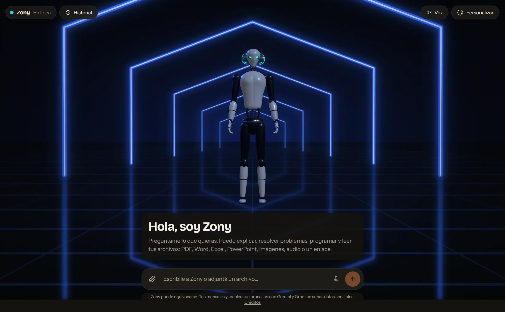
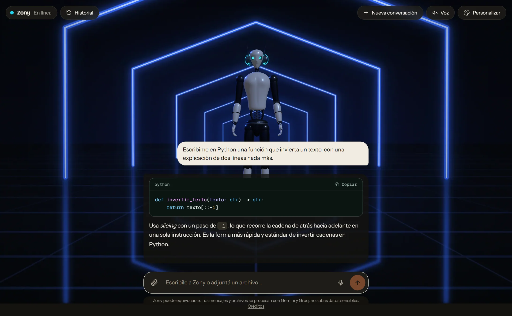
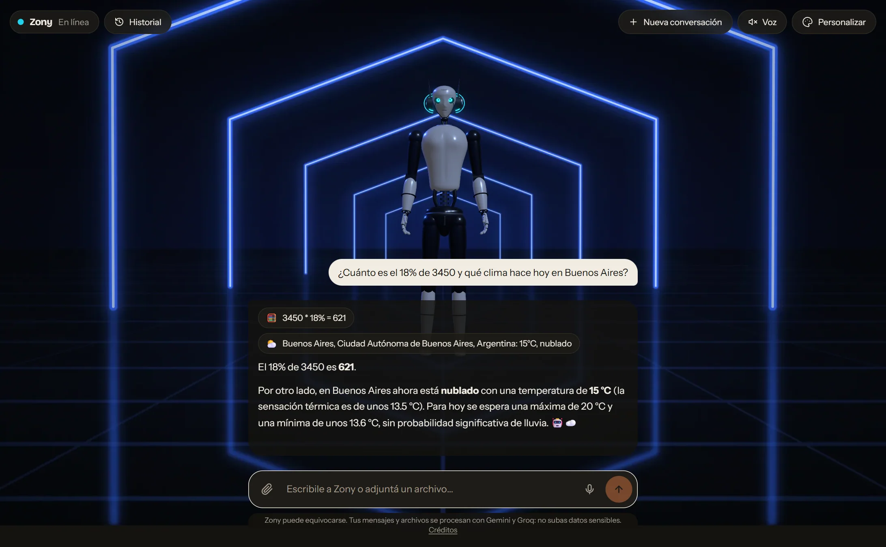
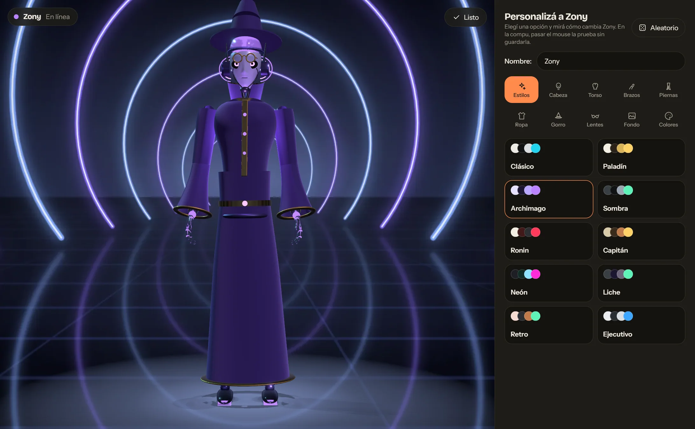
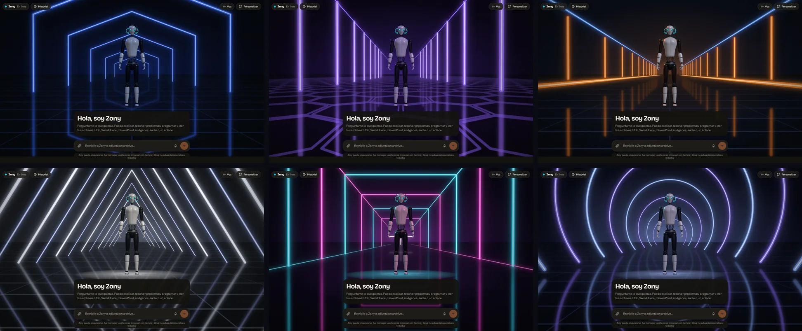
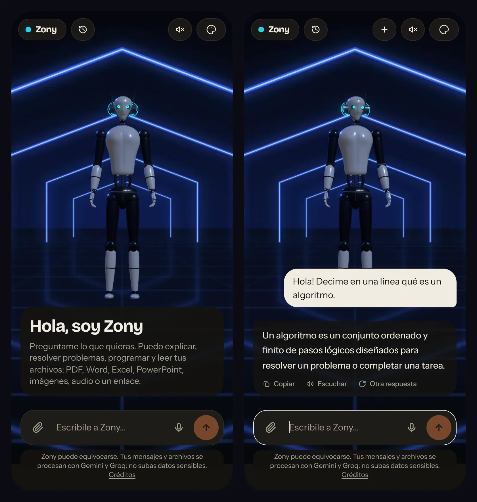

# Zony Chatbot

> **Zony**: an AI chatbot that lives inside a customizable 3D robot.

**[Live demo](https://zony-chatbot.vercel.app)** · [Versión en español](README.md)



A streaming chat assistant that **reads documents, images, audio and links**, whose face and body is a humanoid 3D robot that reacts to the conversation (thinks, waits, talks, shrugs when something fails). The robot is **customizable MMORPG-style**: head, torso, arms, legs, outfit, hat, glasses, colors, background and even its name. The interface is in Spanish.

It runs for free (Gemini free tier with Groq as a backup) and **never goes mute**: when the quota runs out or there is no key, it switches to a demo mode.







## Documentation

The [`docs/`](docs/README.md) folder has the full project analysis (in Spanish) with diagrams GitHub renders natively: [requirements](docs/01-requisitos.md) (26 functional and 12 non-functional), [analysis](docs/02-analisis.md) (use cases, business rules, domain model, risks), [design and architecture](docs/03-diseno.md) (context, containers, components, sequence, activity, state, class, ER and deployment diagrams) and [testing](docs/04-pruebas.md) (strategy and requirement traceability).

## Highlights

- **Resilient on a free tier.** A chain of Gemini models, then Groq, then a built-in demo. Models that fail "rest" for a while so they do not cost every message a timeout.
- **Reads real files:** PDF, images and audio go to the model as they are; Word, Excel, PowerPoint and text are converted server-side. Web and YouTube links are read too.
- **The 3D is optional.** Without WebGL (or after a GPU context loss) the chat keeps working with a still image of the robot.
- **The robot reacts to what is said**, not just to the chat state: rule-based emotions from the first sentence of each answer, with no extra model calls.
- **Voice:** dictation and read-aloud using the browser's Web Speech APIs (no cost, no keys); the robot's mouth follows each spoken word.
- **Own tools:** a calculator (hand-written parser, no `eval`), time in any zone and weather (Open-Meteo). The model decides when to use them and the chat shows what it did.
- **Demo mode:** with no quota or no key, Zony still answers: real calculator, clock and weather, plus canned answers about itself, and every reply says it is a demo.
- **Code highlighting**, "another answer", conversation history stored in the browser (no accounts), light/dark mode, keyboard and reduced-motion support, responsive.
- **Procedural robot and backgrounds:** no downloaded models and no third-party images; the six scenes are drawn by `scripts/build-scenes.mjs`.

## Stack

Next.js 16 (Turbopack) · React 19 · TypeScript · Tailwind CSS 4 · Vercel AI SDK v7 · React Three Fiber, drei and postprocessing · Motion · `react-markdown`

## Run it

Requires Node 20.9+. Without a key the chat still starts, in demo mode.

```bash
npm install
cp .env.example .env.local    # on Windows: copy .env.example .env.local
# set GOOGLE_GENERATIVE_AI_API_KEY (free, no card: aistudio.google.com/apikey)
npm run dev
```

Open http://localhost:3000. See [`.env.example`](.env.example) for every variable, and the Spanish README for the model chain diagram, the technical decisions, the scripts (unit tests, Chrome-based integration tests, screenshots) and the known limits.

On Vercel: import the repo, set `GOOGLE_GENERATIVE_AI_API_KEY` (and optionally `GROQ_API_KEY`), deploy. Request bodies on Vercel Functions are capped at 4.5 MB, so attachments are limited to 3 MB.

## License

[MIT](LICENSE). Zony is an original design with no relation to any film, brand or company. Gemini, Groq, Vercel and other trademarks belong to their owners.
