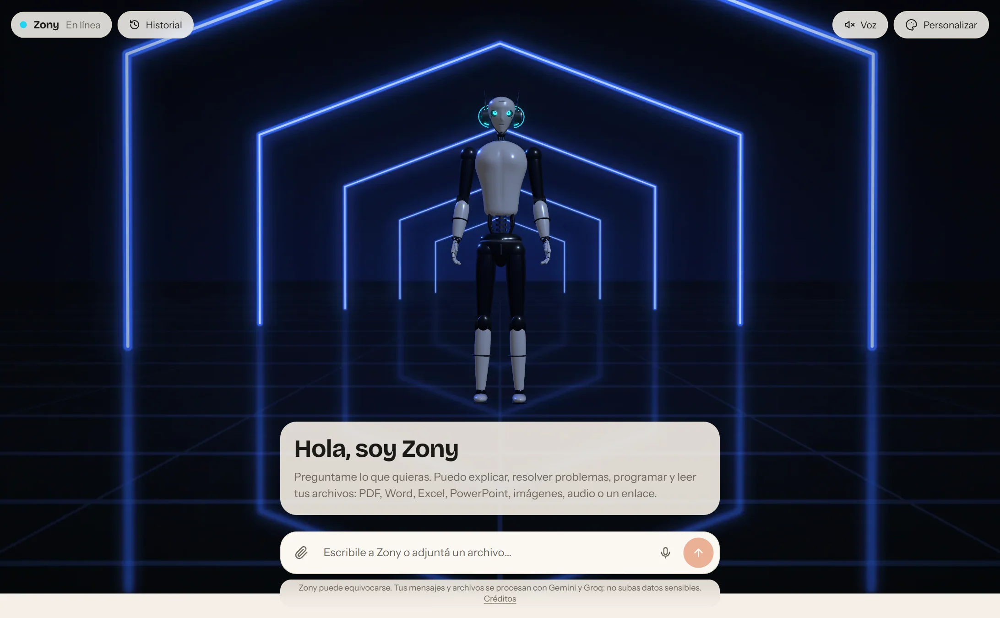

# Zony Chatbot

> **Zony**: un chatbot de IA que vive en un robot 3D personalizable.

**[Demo en vivo](https://zony-chatbot.vercel.app)** · [English version](README.en.md)

[](https://github.com/GermanGiorgis/zony-chatbot/actions/workflows/ci.yml)      


Un asistente conversacional con respuestas en streaming que **lee documentos, imágenes, audio y links**, y que vive en un robot humanoide en 3D que reacciona a la conversación (piensa, espera, habla, se encoge de hombros cuando algo falla). El robot se puede **personalizar** como en un MMORPG: cabeza, torso, brazos, piernas, ropa, sombrero, lentes, colores, fondo y hasta el nombre.

Funciona gratis (capa gratuita de Gemini, con Groq de respaldo) y **nunca se queda mudo**: si la cuota se agota o no hay clave, pasa a un modo demo.

## Capturas

| | |
| --- | --- |
|  |  |
| **Respuestas con código resaltado**, copiar, escuchar y "otra respuesta" | **Herramientas propias**: el modelo calcula y consulta el clima, y el chat muestra qué hizo |
|  |  |
| **Personalizador estilo MMORPG**: 10 estilos, piezas, ropa, colores y fondos | **Modo claro y oscuro** |

Seis fondos, cada uno con el robot parado dentro (la luz de los neones tiñe su cuerpo):


Y en el celular:


## Qué lo hace interesante

- **Funciona gratis y no se cae cuando un modelo se agota.** Prueba una cadena de modelos de Gemini en capa gratuita y, si todos fallan, cae a Groq. Detalle en [Cómo responde](#cómo-responde).
- **Lee archivos de verdad:** PDF, imágenes y audio se envían al modelo tal cual; Word, Excel, PowerPoint y texto/código se convierten a texto en el servidor. Los links de páginas web y de YouTube también se leen.
- **Nunca se queda mudo: modo demo.** Si la cuota gratuita de todos los modelos se agota, o si el servidor no tiene ninguna clave, Zony sigue respondiendo desde `src/lib/ai/demo.ts`: calcula, dice la hora y el clima de verdad (sin IA) y contesta con ejemplos sobre sí mismo, avisando en cada respuesta que es una demo. Es el último eslabón de la cadena de modelos, así que el chat ni siquiera muestra un error. Con eso, el repo se puede clonar y probar sin ninguna clave.
- **El 3D es decoración, no un requisito.** Si el navegador no tiene WebGL, o la GPU pierde el contexto, el chat sigue funcionando con una imagen fija del robot.
- **El robot reacciona a lo que se dice, no solo al estado del chat.** Con la primera frase de cada respuesta ya hace el gesto que corresponde (saluda, festeja una buena noticia, se apena ante una disculpa, se encoge de hombros ante una duda, asiente), sin llamadas extra al modelo: son reglas locales en `src/lib/emotion.ts`. Cuando una herramienta trae su resultado, lo "presenta".
- **Voz:** dictado con el micrófono y lectura de las respuestas en voz alta, con la boca del robot siguiendo cada palabra. Usa las APIs del navegador (Web Speech), así que no cuesta cuota ni necesita claves. Con "Voz" activada, lo que dictás se envía solo y la respuesta se lee al terminar. El texto se limpia antes de leerlo (sin Markdown, sin emoji; los bloques de código se resumen) y se elige una voz en español latinoamericano o en inglés según la respuesta (`src/lib/speech.ts`).
- **Herramientas propias:** calculadora (evaluador matemático escrito a mano, sin `eval`), hora de cualquier zona y clima de una ciudad (Open-Meteo, sin clave). El modelo decide cuándo usarlas y el chat muestra qué hizo.
- **Código con colores** (22 lenguajes) y botón **"Otra respuesta"** para regenerar la última respuesta.
- **Historial de conversaciones** guardado en el navegador (renombrar, borrar, restaurar al recargar), sin cuentas.
- **Accesible y responsive:** teclado, foco, `prefers-reduced-motion`, modo claro y oscuro, celular.

## Stack

Next.js 16 (Turbopack) · React 19 · TypeScript · Tailwind CSS 4 · Vercel AI SDK v7 · React Three Fiber, drei y postprocessing · Motion · `react-markdown`

## Cómo responde

```
Navegador ── POST /api/chat ──▶ validación + límite por IP ──▶ prepareMessages
                                                                   │  (adjuntos → texto, topes de tamaño)
                                                                   ▼
                      gemini-3.1-flash-lite ─▶ gemini-3.8-flash ─▶ gemini-3.5-flash-lite ─▶ Groq (gpt-oss-120b) ─▶ modo demo
                              cada uno con tiempo máximo de arranque; el que falla "descansa" 30 s (2 min o 30 min si es cuota)
```

- `src/lib/ai/model.ts` envuelve el modelo con un middleware de respaldo: reintenta en el siguiente ante 429/5xx/timeouts, recuerda qué modelos fallaron recientemente para no volver a esperarlos y da una segunda vuelta si todos estaban ocupados.
- Los pedidos con **archivos, imágenes o links** nunca caen a Groq (solo lee texto): se quedan en Gemini y esperan más tiempo el primer token. Las herramientas propias, en cambio, funcionan en cualquiera de los dos. Un mensaje con link usa la lectura de páginas de Gemini y no las herramientas propias (Gemini no mezcla ambas en una misma petición).
- `src/lib/ai/prepare.ts` limita lo que llega al modelo: 5 archivos por mensaje, 3 MB por archivo y en total (el límite de cuerpo de las funciones de Vercel es 4,5 MB y los archivos viajan en base64), 120 000 caracteres por documento y 200 000 en toda la conversación, 30 000 caracteres por mensaje y los últimos 24 mensajes de historial.
- `src/lib/rate-limit.ts`: 12 mensajes por minuto y 200 por día por visitante (en memoria: es una protección de cuota, no de seguridad).
- Cada turno reenvía la conversación completa. Si pesa demasiado para Vercel, el navegador reemplaza los adjuntos más viejos por una nota antes de enviar (`src/lib/payload.ts`); los del mensaje actual nunca se recortan.
- Los errores del proveedor se traducen a mensajes claros en español (`src/lib/ai/errors.ts`) y no se registran con el cuerpo de la petición.

## Decisiones técnicas

Lo que elegí y por qué (más detalle en el código, donde cada archivo explica su motivo):

- **Cadena de modelos con respaldo, no un solo modelo.** Cada modelo de la capa gratuita tiene su propia cuota diaria; encadenarlos multiplica los mensajes por día y sumar Groq y un modo demo hace que el chat nunca falle de cara a la persona. Los modelos que fallan "descansan" (30 s si están ocupados, 30 min si agotaron la cuota diaria) para no cobrar 8 s de espera en cada mensaje.
- **Herramientas propias o del proveedor, según el mensaje.** Gemini no permite mezclar sus herramientas (leer links) con las funciones propias en una misma petición: si hay un link se usa la lectura de páginas de Gemini; si no, la calculadora, la hora y el clima.
- **Calculadora sin `eval`.** El modelo (o un visitante) puede pasarle cualquier texto; un parser propio solo produce un número o un error.
- **Robot procedural en vez de un modelo descargado.** Perfiles de revolución y mallas esculpidas en código: pesa casi nada, es 100 % personalizable (cada pieza es intercambiable) y no depende de licencias de assets de terceros.
- **El fondo vive dentro del espacio 3D.** Una imagen detrás del robot más una versión diminuta usada como mapa de entorno: así los neones se reflejan en su cuerpo y parece parado en la escena, en vez de pegado sobre una foto. Los seis fondos los dibuja `scripts/build-scenes.mjs` con una cámara en perspectiva (sin fotos ni imágenes de terceros).
- **Emociones con reglas locales.** Con la primera frase de cada respuesta el robot ya reacciona (`src/lib/emotion.ts`), sin una segunda llamada al modelo.
- **Voz con las APIs del navegador.** Dictado y lectura en voz alta sin costo ni claves; la boca del robot se mueve con cada palabra que informa el motor de voz.
- **Historial en el navegador, sin cuentas.** `localStorage` con `useSyncExternalStore` (lo que escribís no pasa por una base de datos propia) y sincronización entre pestañas.
- **El 3D es opcional.** Sin WebGL, o si la GPU pierde el contexto, el chat sigue funcionando con una imagen fija del robot.
- **Pensado para el límite de 4,5 MB de Vercel.** Los archivos viajan en base64 y cada turno reenvía la conversación: topes de 3 MB y recorte de adjuntos viejos antes de enviar (`src/lib/payload.ts`).
- **Sin datos personales en las métricas.** `src/lib/analytics.ts` escribe cuántos mensajes, qué herramienta y qué código de error; nunca texto ni nombres de archivo.
- **Pruebas donde importan.** Pruebas unitarias para la lógica pura (límites, adjuntos, calculadora, voz, demo, emociones) y scripts con Chrome headless que recorren la interfaz real, incluida la voz con un motor simulado.

## Probarlo en tu máquina

Requiere Node 20.9 o superior. Sin clave el chat arranca igual, en modo demo.

```bash
npm install
cp .env.example .env.local     # en Windows: copy .env.example .env.local
# completá GOOGLE_GENERATIVE_AI_API_KEY (gratis, sin tarjeta: aistudio.google.com/apikey)
npm run dev
```

Abrí http://localhost:3000.

## Publicarlo en Vercel

1. Importá el repositorio en Vercel (Next.js se detecta solo).
2. Cargá `GOOGLE_GENERATIVE_AI_API_KEY` (y, si querés respaldo, `GROQ_API_KEY`) en *Settings → Environment Variables*.
3. Desplegá. La URL pública para las vistas previas sociales se toma de `VERCEL_PROJECT_PRODUCTION_URL`, que Vercel define solo.

Variables (ver `.env.example`):

| Variable | Para qué |
| --- | --- |
| `GOOGLE_GENERATIVE_AI_API_KEY` | Clave de Gemini (sin ella, el chat funciona en modo demo) |
| `GROQ_API_KEY` | Opcional: respaldo cuando Gemini agota su cuota |
| `GEMINI_WEB_SEARCH` | Opcional: `true` activa la búsqueda en Google (solo en capa paga de Gemini) |
| `AI_GATEWAY_API_KEY` · `CHAT_MODEL` | Opcional: backend alternativo con Vercel AI Gateway (solo si no hay clave de Gemini) |
| `GEMINI_MODELS` | Opcional: modelos de Gemini a probar, en orden |
| `GROQ_MODEL` | Opcional: modelo de Groq (por defecto `openai/gpt-oss-120b`) |
| `GEMINI_START_TIMEOUT_MS` | Opcional: cuánto esperar el primer token antes de pasar al siguiente modelo |
| `ALLOWED_DEV_ORIGINS` | Opcional: IPs de tu red local que pueden abrir el servidor de desarrollo |

## Scripts

| Comando | Qué hace |
| --- | --- |
| `npm run dev` / `build` / `start` | Desarrollo y producción |
| `npm run typecheck` · `npm run lint` | TypeScript y ESLint |
| `npm test` | Pruebas unitarias (límite por IP, nombre del robot, adjuntos, errores, calculadora, reacciones del robot, voz, demo) |
| `npm run qa:api` | Prueba a mano la API real con adjuntos y entradas inválidas (usa cuota del modelo) |
| `npm run qa:ui` | Recorre la interfaz real en Chrome headless: enviar, recargar, historial, detener |
| `node scripts/qa/no-webgl.mjs` | Verifica que sin WebGL el chat siga funcionando |
| `node scripts/qa/features.mjs` | Herramientas, código resaltado, "Otra respuesta" y reacciones del robot en la interfaz real |
| `node scripts/qa/mobile.mjs` | Recorre la interfaz en tamaño de celular |
| `node scripts/qa/voice.mjs` | Voz en la interfaz real con un motor de voz y un reconocedor simulados (dictado, envío, lectura, botón Escuchar) |
| `npm run posters` | Regenera las imágenes de carga del robot (con el servidor de desarrollo corriendo) |
| `npm run scenes` | Redibuja los 6 fondos desde código (`scripts/build-scenes.mjs`) |
| `npm run qa:scenes` | Captura al robot en cada fondo, en claro y oscuro |
| `npm run screenshots` | Regenera las capturas de este README (`docs/screenshots`) desde la app real |

Los scripts de `scripts/qa` esperan el servidor en `http://localhost:3100` (`npm run dev -- -p 3100`); se cambia con `BASE_URL`. Usan Chrome o Edge: si no los encuentran, definí `CHROME_PATH`.

La integración continua (`.github/workflows/ci.yml`) corre typecheck, lint, pruebas y build en cada push.

## Cómo saber si lo usan

`src/lib/analytics.ts` escribe una línea JSON por evento en el log del servidor (en Vercel se puede filtrar por `"zony"`): `chat` (cantidad de mensajes, archivos, si trajo link, si le cambiaron el nombre), `tool` (qué herramienta se usó) y `error` (código de estado). No guarda texto, nombres de archivo ni nada que haya escrito la persona.

## El robot

Está armado con geometría procedural (sin modelos descargados): perfiles de revolución y mallas esculpidas en `src/components/robot/parts`, un rig propio (`rig.ts`) con gestos (saludar, pensar, esperar, encogerse de hombros) y una escena (`Scene.tsx`) donde el fondo es una imagen dentro del espacio 3D: la misma imagen, reducida, ilumina y se refleja en el robot, así que los neones del fondo tiñen su cuerpo. Los seis fondos tampoco son fotos: los dibuja `scripts/build-scenes.mjs` proyectando neones, anillos y pisos de hexágonos con una cámara en perspectiva.

## Límites conocidos

- **Capa gratuita:** cada modelo tiene cuota diaria compartida entre todos los visitantes. Cuando se agota todo, Zony pasa al modo demo (respuestas de ejemplo, avisando que lo son) hasta que la cuota se renueva.
- **Límite por IP en memoria:** en serverless es por instancia. Para un uso real haría falta un almacenamiento compartido (Redis/KV).
- **Historial en el navegador:** vive en `localStorage`; no se sincroniza entre dispositivos. Los adjuntos no se guardan, solo una marca con el nombre.
- **Privacidad:** los mensajes y archivos se procesan con Gemini y Groq en sus capas gratuitas, que pueden usar el contenido para mejorar sus servicios. La app lo avisa; no subas datos sensibles. El dictado lo procesa el navegador (Chrome y Edge envían el audio a sus servidores; Firefox no tiene reconocimiento de voz y ahí el botón no aparece).
- **Voz:** la calidad y la lista de voces dependen del sistema de cada persona; la sincronía de la boca sigue las palabras que informa el motor de voz (no es sincronía labial por fonemas).

## Estructura

```
src/app/api/chat/route.ts      endpoint: validación, límites, streaming
src/lib/ai/                    cadena de modelos, modo demo, herramientas, adjuntos, errores, instrucciones
src/lib/                       historial, voz, emociones, límite por IP, recorte de adjuntos
src/components/Chat.tsx        interfaz del chat (y src/components/chat/: mensajes, composer, voz)
src/components/robot/          robot 3D, escena, rig y personalizador
scripts/build-scenes.mjs       dibuja los seis fondos
scripts/qa/                    pruebas de integración con Chrome headless y capturas del README
tests/                         pruebas unitarias
docs/screenshots/              capturas del README
.claude/agents/                agente analista usado para revisar el proyecto (sin tocar el código)
```

## Licencia

Código bajo licencia [MIT](LICENSE). Zony, su nombre y su diseño son parte de este proyecto de portfolio; el robot es un diseño original y no tiene relación con ninguna película, marca o empresa. Gemini, Groq, Vercel y las demás marcas mencionadas pertenecen a sus dueños.
