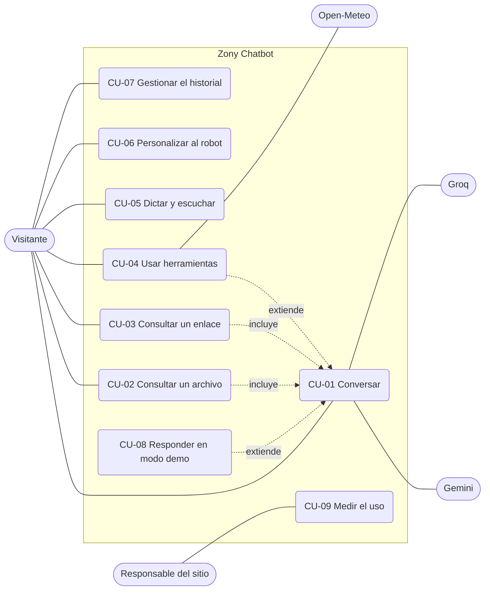
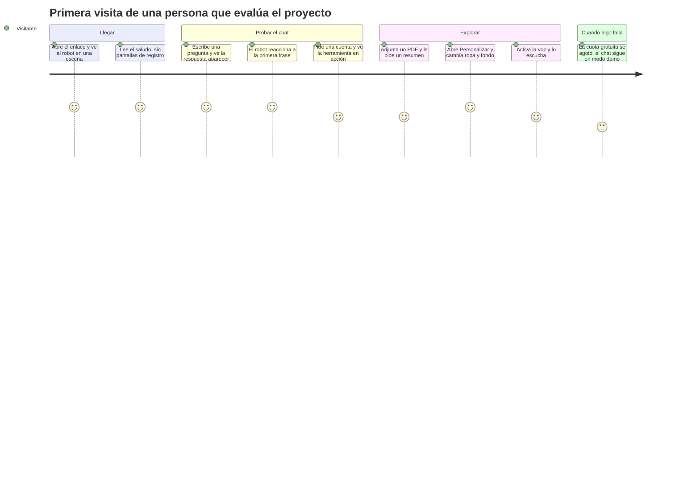
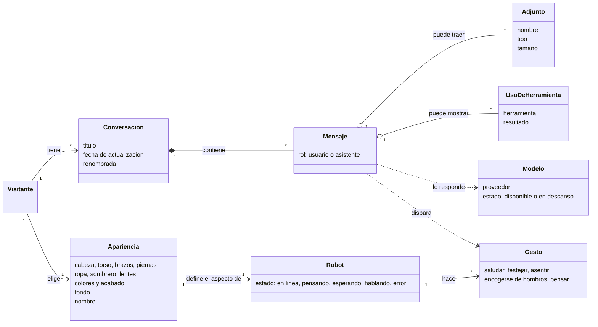

# 2. Análisis

Antes de escribir código conviene entender qué problema se resuelve, para quién y qué puede salir mal. Este documento responde esas preguntas.

## 2.1 El problema

Los chatbots de IA gratuitos tienen tres problemas que se notan enseguida:

1. **Se caen.** La capa gratuita de un modelo tiene cuota diaria; cuando se agota, la persona ve un error.
2. **Son iguales.** Una caja de texto sin personalidad, que no se siente como "alguien".
3. **Son mudos y ciegos.** No leen un archivo o un enlace, no usan herramientas, no hablan.

**Objetivo.** Un chat que siga funcionando cuando los modelos gratuitos se agotan, que lea archivos y enlaces, que hable, y que tenga un cuerpo (un robot 3D) con el que dé gusto interactuar. Además, tiene que ser un proyecto de portfolio defendible: sin imágenes de terceros, con pruebas, documentación y despliegue real.

**Quién lo usa.** Dos perfiles: una persona que quiere conversar o consultar un archivo, y una persona que evalúa el proyecto (por ejemplo, un reclutador) y tiene un minuto para impresionarse. El segundo perfil manda en las decisiones de primera impresión: carga rápida, que funcione sin configurar nada y que nunca muestre un error.

## 2.2 Casos de uso

### Descripción de los casos de uso principales

**CU-01 Conversar**

| | |
| --- | --- |
| Actor | Visitante |
| Precondición | La página está abierta |
| Flujo principal | 1. Escribe un mensaje y lo envía. 2. El robot se orienta hacia el cuadro de texto y reacciona al envío. 3. El sistema valida, aplica el límite de uso y prepara la conversación. 4. La respuesta llega en streaming; el robot pasa de "pensando" a "hablando" y hace un gesto según la primera frase. 5. La conversación se guarda en el navegador. |
| Alternativas | A1. Si un modelo falla, el sistema pasa al siguiente sin que la persona lo note. A2. Si todos fallan, responde el modo demo (CU-08). A3. Si supera el límite de mensajes, ve cuánto tiene que esperar. A4. Puede detener la respuesta o pedir otra. |
| Postcondición | El mensaje y la respuesta quedan guardados en el historial |

**CU-02 Consultar un archivo**

| | |
| --- | --- |
| Actor | Visitante |
| Precondición | Tiene un archivo de hasta 3 MB en un formato soportado |
| Flujo principal | 1. Adjunta el archivo (clip, arrastrar o pegar). 2. La interfaz valida cantidad y tamaño y muestra una miniatura. 3. Escribe su pregunta y envía. 4. El servidor lee el archivo: los PDF, imágenes y audio van al modelo tal cual; los documentos de Office y el texto se convierten a texto. 5. El modelo responde usando el contenido. |
| Alternativas | A1. Un archivo demasiado grande, de un formato no soportado o vacío se omite con un aviso claro en la conversación. A2. Si hay archivos, solo Gemini puede responder (Groq lee solo texto). |
| Postcondición | En el historial queda una marca con el nombre del archivo (el archivo no se guarda) |

**CU-03 Consultar un enlace.** Igual que CU-01, pero si el mensaje trae una URL de una página o de YouTube, el sistema le da a Gemini su herramienta de lectura de enlaces. En ese caso no se ofrecen las herramientas propias (Gemini no permite mezclarlas en la misma petición).

**CU-04 Usar herramientas.** El modelo decide por su cuenta cuándo calcular, consultar la hora o el clima. El resultado vuelve al modelo, que lo explica, y el chat muestra una etiqueta con lo que se hizo.

**CU-05 Dictar y escuchar.** El visitante toca el micrófono y habla; las palabras aparecen en el cuadro de texto. Con **Voz** activada, lo dictado se envía solo y la respuesta se lee en voz alta. La boca del robot sigue la voz.

**CU-06 Personalizar al robot.** El visitante abre **Personalizar**, elige un estilo o cambia parte por parte, ve una vista previa al pasar el mouse y la apariencia se guarda. Puede ponerle nombre; el modelo lo usará para presentarse.

**CU-07 Gestionar el historial.** Abrir una conversación anterior, renombrarla, borrarla, empezar una nueva o borrar todo.

**CU-08 Responder en modo demo.** Cuando no queda ningún modelo disponible (o el servidor no tiene clave), el sistema responde igual: calcula, dice la hora y el clima de verdad, y contesta con ejemplos sobre sí mismo. Cada respuesta termina avisando que es una demo.

**CU-09 Medir el uso.** El responsable del sitio filtra el log del servidor y ve cuántos mensajes, qué herramientas y qué errores hubo, sin ver nada de lo que escribieron las personas.

## 2.3 Recorrido del usuario

Cómo se siente una primera visita, de 1 (frustrante) a 5 (excelente) según el diseño buscado:

El único punto "3" es el modo demo: es a propósito. Es mejor una respuesta honesta de ejemplo que un error.

## 2.4 Reglas de negocio

Las reglas que el sistema aplica siempre, sin que la persona las vea:

| ID | Regla |
| --- | --- |
| RN-01 | **Orden de respaldo:** los modelos de Gemini en el orden configurado, después Groq (si hay clave), después el modo demo. |
| RN-02 | **Descanso:** un modelo que falla no se vuelve a pedir durante un rato: 30 s si estaba ocupado, 2 min si superó un límite de uso, 30 min si agotó la cuota del día. Los que descansan van al final de la cadena, no se descartan. |
| RN-03 | **Tiempo de arranque:** un modelo tiene 8 s para empezar a responder (22 s si el pedido trae archivos o enlaces); si no, se pasa al siguiente. |
| RN-04 | **Solo Gemini lee archivos y enlaces.** Groq se salta cuando el pedido los trae. |
| RN-05 | **Herramientas:** si el mensaje trae un enlace, se usa la lectura de enlaces de Gemini; si no, las herramientas propias (calculadora, hora, clima). |
| RN-06 | **Límite de uso:** 12 mensajes por minuto y 200 por día por visitante. |
| RN-07 | **Límites de contenido:** 5 archivos por mensaje, 3 MB de archivos, 30 000 caracteres por mensaje, 120 000 por documento, 200 000 de texto de documentos por conversación, y se envían como máximo los últimos 24 mensajes. |
| RN-08 | **Solo archivos subidos:** el servidor nunca descarga una URL que haya elegido el visitante. |
| RN-09 | **Tamaño de la petición:** si la conversación con sus archivos supera ~4,2 MB, el navegador reemplaza los adjuntos más viejos por una nota; los del mensaje actual no se tocan. |
| RN-10 | **El modo demo nunca se hace pasar por IA:** toda respuesta demo lo declara. |
| RN-11 | **El nombre del robot es solo un nombre:** se limpia y se le indica al modelo que no lo trate como instrucción. |
| RN-12 | **Los datos de uso no incluyen texto:** solo contadores y códigos de error. |

## 2.5 Modelo del dominio

Los conceptos que maneja el sistema y cómo se relacionan (es un modelo **conceptual**: no es lo que se guarda tal cual, eso está en el [diseño](03-diseno.md#8-datos)):

## 2.6 Riesgos y cómo se tratan

| # | Riesgo | Probabilidad | Impacto | Respuesta |
| --- | --- | --- | --- | --- |
| 1 | Se agota la cuota gratuita de todos los modelos | Alta | Alto (primera impresión) | Cadena de respaldo, Groq y modo demo. Descanso de modelos para no perder tiempo |
| 2 | Un visitante gasta toda la cuota | Media | Alto | Límite por minuto y por día; topes de tamaño y de texto por mensaje |
| 3 | Archivos demasiado grandes para Vercel (4,5 MB) | Alta | Medio | Tope de 3 MB; recorte de adjuntos viejos; probado en producción con 4 MB |
| 4 | El modelo obedece instrucciones escondidas en un archivo o página | Media | Medio | Las instrucciones del sistema avisan que el contenido de archivos es dato, no órdenes; las herramientas son de solo lectura y a servidores fijos |
| 5 | El navegador no tiene WebGL, o la GPU se reinicia | Media | Medio | El 3D es opcional: se cae a una imagen fija y el chat sigue |
| 6 | Un teléfono lento no aguanta el 3D | Media | Medio | Monitor de rendimiento: baja la densidad de píxeles y el suavizado |
| 7 | Se pierde el historial (almacenamiento lleno o bloqueado) | Baja | Medio | Aviso bajo el cuadro de texto; la app sigue funcionando |
| 8 | Se filtra una clave | Baja | Alto | Claves solo en variables de entorno; `.env*` ignorado; revisado que no haya claves en archivos ni en el historial |
| 9 | Problemas de licencia con imágenes de terceros | Era alta | Medio | Se eliminaron: robot y fondos se generan por código |
| 10 | La voz no funciona en algún navegador | Media | Bajo | El botón del micrófono solo aparece si el navegador lo soporta; el resto del chat no depende de la voz |

## 2.7 Alternativas descartadas

| Idea | Por qué no |
| --- | --- |
| **Un solo modelo, sin respaldo** | Se agota la cuota del día y la primera impresión es un error |
| **Fotos como fondo** | Se veían pegadas, el robot no parecía estar dentro, y su licencia no permite redistribuirlas en un repo público |
| **Modelo 3D descargado del robot** | Dependencia de licencias de terceros, pesado y menos personalizable que piezas generadas por código |
| **Base de datos y cuentas** | Costo y complejidad sin necesidad: el historial en el navegador alcanza para una demo y mejora la privacidad |
| **Reconocimiento de voz propio en el servidor** | Cuesta cuota y dinero; las APIs del navegador son gratuitas |
| **Una segunda llamada al modelo para decidir el gesto del robot** | Gasta cuota y suma espera; unas reglas locales sobre la primera frase alcanzan |
| **Tarjetas de preguntas sugeridas en el inicio** | Distraían del robot y tapaban su cuerpo; el saludo ya explica qué sabe hacer |
| **Mostrar un error cuando la cuota se agota** | Mala primera impresión; el modo demo es honesto y sigue siendo útil |

Siguiente: [3. Diseño y arquitectura](03-diseno.md).
