# 3. Diseño y arquitectura

Cómo está construido el sistema. Va de lo más general (quién habla con quién) a lo más concreto (clases y datos). Los nombres de archivos son reales: se pueden buscar en el repositorio.

## 3.1 Contexto

El sistema visto desde afuera: una aplicación web, las personas que la usan y los servicios con los que habla.

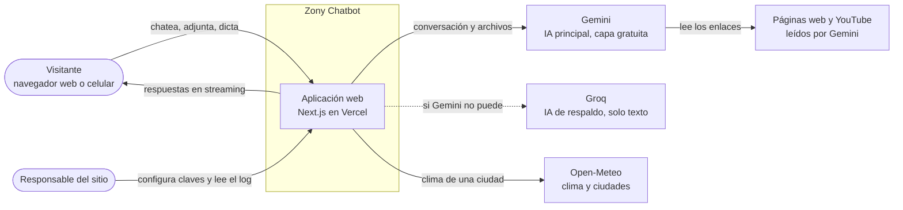

## 3.2 Contenedores

Las dos partes que se despliegan y el almacenamiento. No hay base de datos.

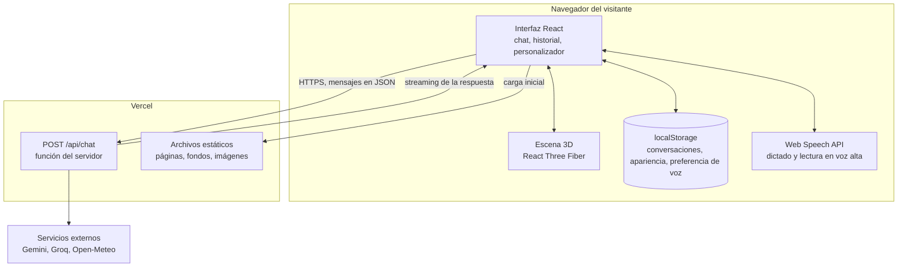

## 3.3 Componentes

### Servidor (`src/app/api` y `src/lib`)

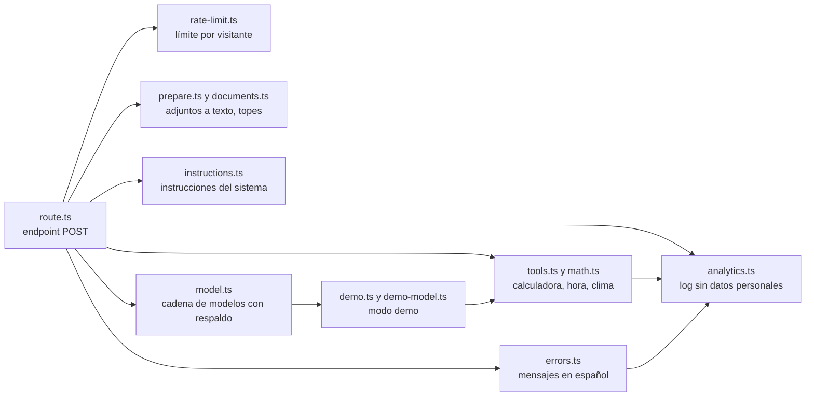

| Módulo | Responsabilidad |
| --- | --- |
| `route.ts` | Orquesta cada pedido: límite, validación, preparación, elección de herramientas, llamada al modelo y devolución en streaming |
| `rate-limit.ts` | Ventana deslizante en memoria: 12 por minuto y 200 por día por visitante |
| `prepare.ts`, `documents.ts` | Convierte los adjuntos: lo nativo pasa, Office y texto se vuelven texto; aplica todos los topes |
| `instructions.ts` | Arma las instrucciones: personalidad, nombre del robot, herramientas, aviso contra instrucciones escondidas en archivos |
| `tools.ts`, `math.ts` | Herramientas de solo lectura; el evaluador matemático no usa `eval` |
| `model.ts` | Envuelve los modelos con un middleware de respaldo, tiempos de arranque y descanso |
| `demo.ts`, `demo-model.ts` | Respuestas sin IA, presentadas como un modelo más para que el resto del sistema no note la diferencia |
| `errors.ts` | Traduce errores de proveedores a mensajes claros; registra solo estado y mensaje, nunca el cuerpo del pedido |
| `analytics.ts` | Una línea JSON por evento, sin texto ni nombres de archivo |

### Navegador (`src/components` y `src/lib`)

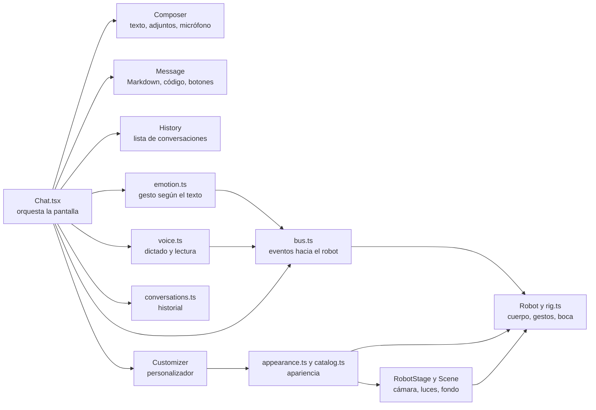

La comunicación entre el chat y el robot pasa por `bus.ts`, un canal de eventos mínimo: el chat dice "hacé este gesto", "mirá hacia acá" o "abrí la boca"; el robot no sabe nada del chat. Así el 3D se puede apagar sin tocar la lógica.

## 3.4 Secuencias

### a) Un mensaje de texto

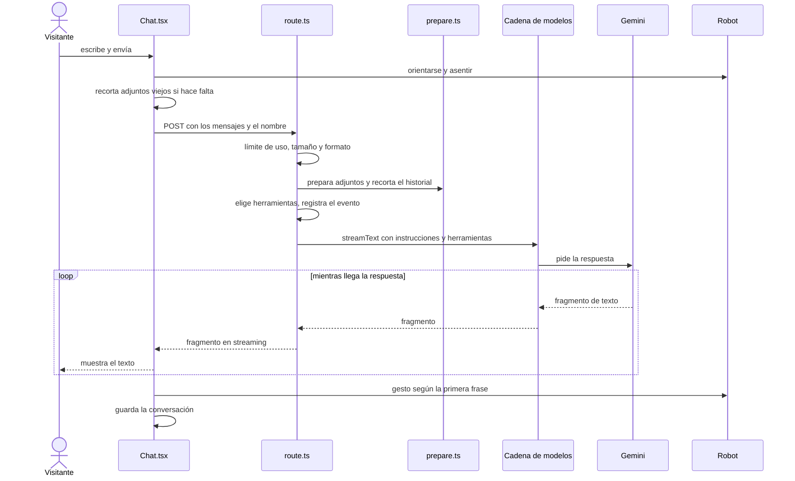

### b) Cuando un modelo falla

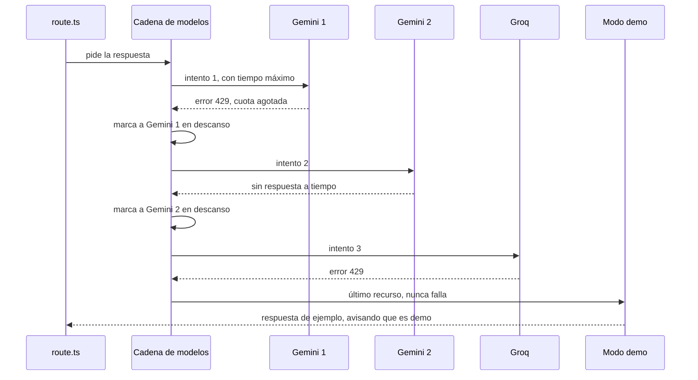

Los modelos en descanso pasan al final de la cadena en los pedidos siguientes, así que la persona no vuelve a esperar por ellos.

### c) Un archivo adjunto

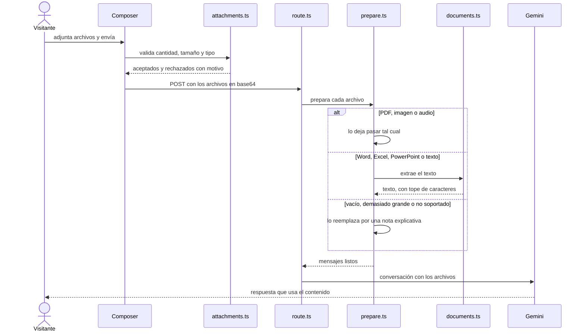

### d) Voz: dictar y escuchar

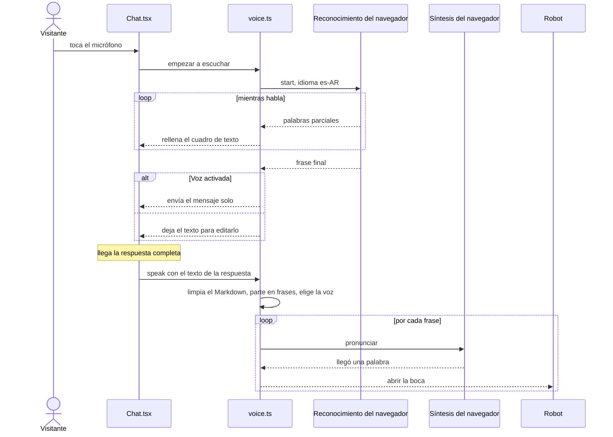

## 3.5 Flujos de decisión

### El pedido a `/api/chat`

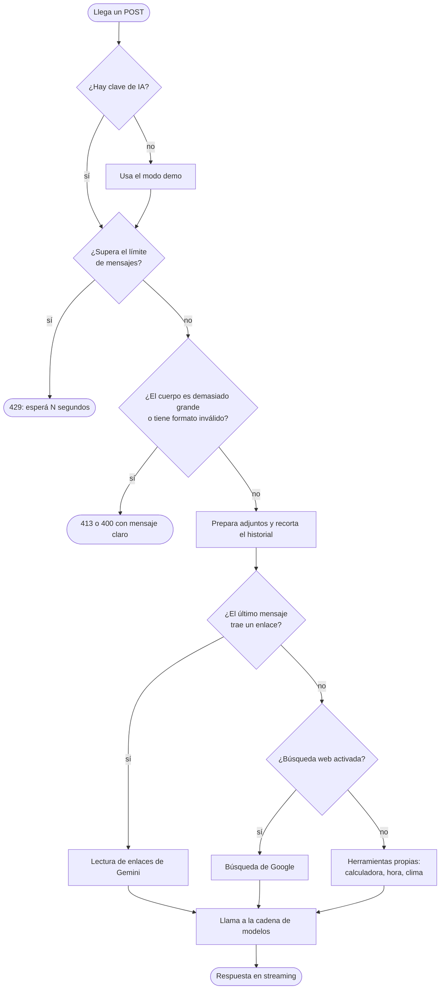

### La cadena de respaldo

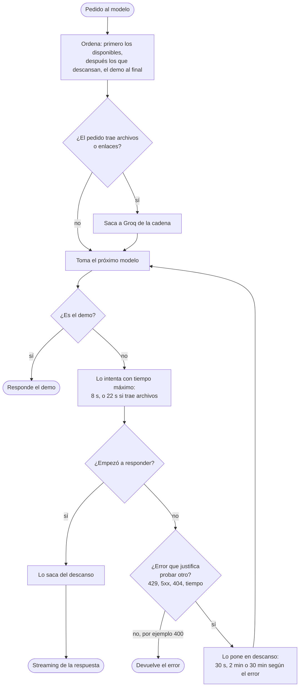

### Preparación de cada adjunto

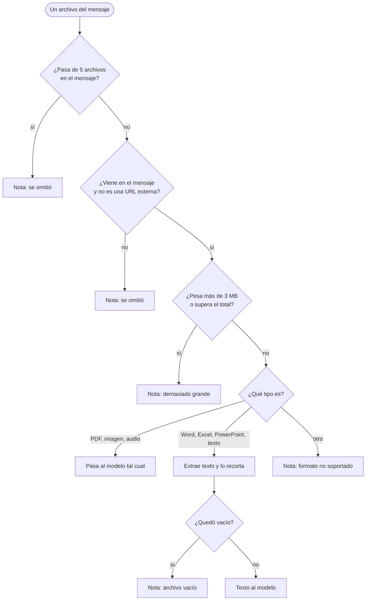

## 3.6 Estados

### El robot

El estado del chat se traduce al estado del robot. Los gestos puntuales (saludar, festejar...) se superponen a estos estados.

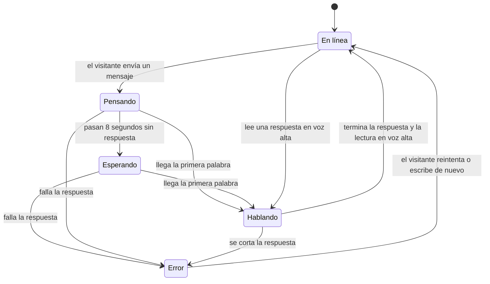

### El pedido de respuesta (estado del chat)

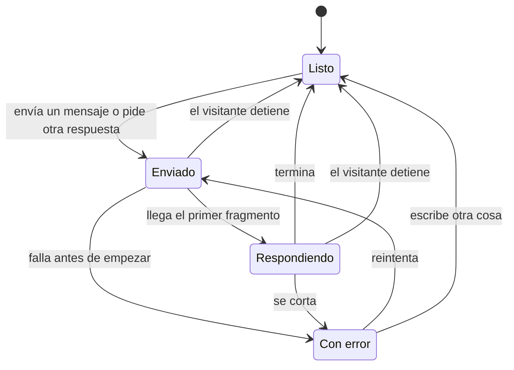

### El dictado

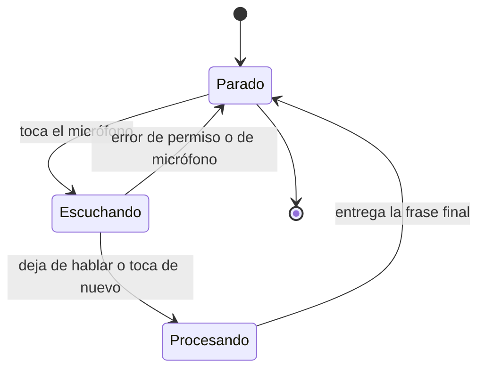

### Un modelo de la cadena

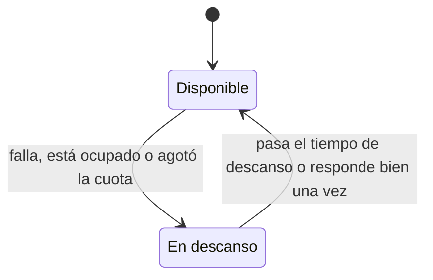

## 3.7 Clases y módulos clave

Cómo se organiza el código de la cadena de modelos y las herramientas.

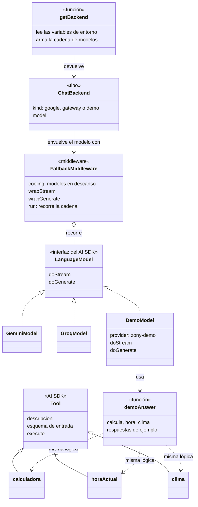

La idea clave: el modo demo es **un modelo más** que cumple la misma interfaz que Gemini y Groq. Para el resto del sistema (streaming, interfaz, robot, voz) no hay diferencia entre una respuesta real y una de demo.

## 3.8 Datos

No hay base de datos: todo lo persistente vive en el `localStorage` del navegador de cada persona. Esto es lo que se guarda:

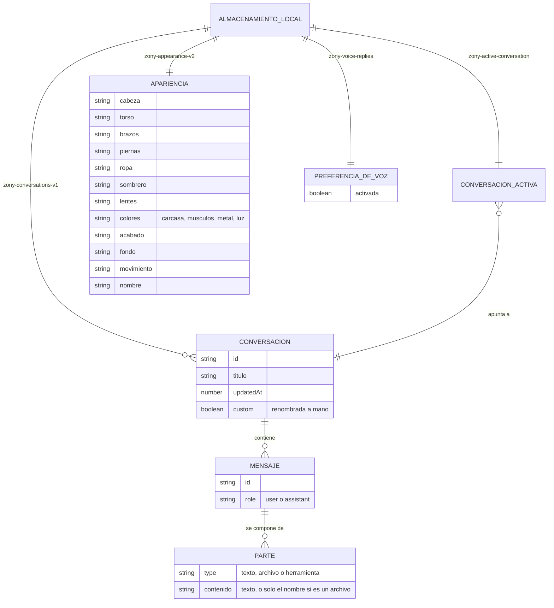

| Dato | Detalle |
| --- | --- |
| Conversaciones | Hasta 60; título de 60 caracteres como máximo; los adjuntos no se guardan, solo una marca con el nombre |
| Apariencia | Se valida al leerla: un valor desconocido o un color inválido vuelve al valor por defecto |
| Sincronización entre pestañas | Un evento `storage` hace que cada pestaña vuelva a leer antes de escribir, para no pisarse |
| Si el almacenamiento falla | La app sigue funcionando y avisa una vez bajo el cuadro de texto |
| En el servidor | Solo un contador en memoria para el límite de mensajes; nada de contenido |

## 3.9 Despliegue

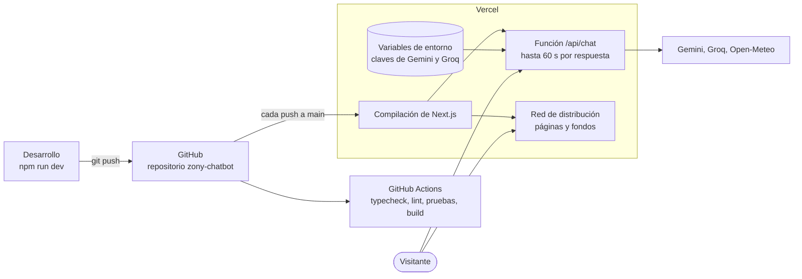

| Pieza | Detalle |
| --- | --- |
| Variables | `GOOGLE_GENERATIVE_AI_API_KEY` y, opcional, `GROQ_API_KEY`. Sin ellas el sitio arranca en modo demo. Lista completa en `.env.example` |
| Límite de Vercel | Cuerpo de petición de 4,5 MB: de ahí el tope de 3 MB en adjuntos |
| Duración | La función puede tardar hasta 60 s en responder (`maxDuration`) |
| Lo que no se despliega | Las imágenes originales, los datos del entorno local y los archivos de trabajo (`.gitignore`) |

## 3.10 Cómo se dibuja el robot

Un recorrido por el flujo del 3D, para quien quiera entender cómo "vive" el robot.

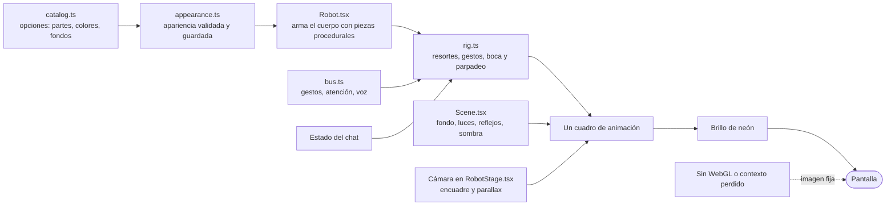

- **Piezas procedurales:** el cuerpo es geometría generada en código (perfiles de revolución y mallas esculpidas), no un modelo descargado.
- **Fondo dentro de la escena:** la imagen del fondo está detrás del robot y una versión diminuta de la misma sirve de mapa de entorno, así los neones se reflejan en sus piezas brillantes.
- **Los fondos** los dibuja `scripts/build-scenes.mjs`: proyecta neones, anillos y pisos con una cámara en perspectiva (horizonte al centro, altura de ojo de la cámara del 3D) y los guarda como imágenes.

Siguiente: [4. Pruebas](04-pruebas.md).
