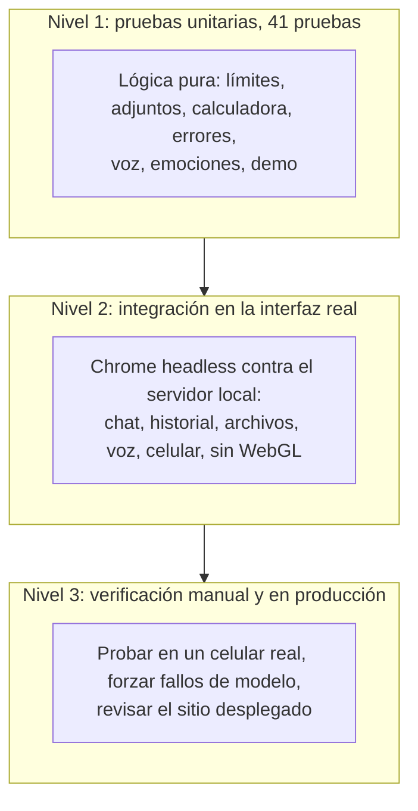

# 4. Pruebas

Cómo se comprueba que el sistema hace lo que dicen los [requisitos](01-requisitos.md).

## 4.1 Estrategia

Hay tres niveles, de lo más rápido y barato a lo más realista:

| Nivel | Cuándo corre | Cuánto tarda | Usa cuota de IA |
| --- | --- | --- | --- |
| 1. Unitarias | En cada cambio, en local y en el CI | ~6 segundos | No |
| 2. Integración | A mano, antes de publicar un cambio importante | Minutos | Sí, algunas |
| 3. Manual y producción | Al desplegar | Variable | Sí |

**Criterio.** La lógica que decide cosas (límites, conversión de archivos, errores, gestos, respuestas del demo) está escrita como funciones puras y se prueba con muchos casos. Lo que depende del navegador real (3D, voz, móvil) se prueba manejando Chrome de verdad, porque ahí es donde se rompe.

## 4.2 Qué cubre cada prueba

### Unitarias (`npm test`)

| Archivo | Qué comprueba |
| --- | --- |
| `rate-limit.test.ts` | Deja pasar 12 mensajes por minuto y después pide esperar; cada visitante tiene su ventana; confía en el encabezado de la plataforma antes que en uno falsificable |
| `prepare.test.ts` | Convierte texto en un bloque de documento; reemplaza archivos vacíos, enormes o no soportados por una nota; lee solo los primeros 5 archivos; limita el texto de documentos en toda la conversación; corta mensajes larguísimos; separa enlaces de YouTube |
| `payload.test.ts` | Reemplaza los adjuntos más viejos cuando la conversación no entra en la petición y nunca toca los del mensaje actual |
| `errors.test.ts` | Traduce fallos de proveedores a mensajes claros con el nombre del robot; no filtra nombres de claves ni rutas; no registra el cuerpo del pedido |
| `math.test.ts` | Precedencia, porcentajes, constantes y funciones, `×` y `÷`; informa errores en vez de adivinar; **no se puede usar para ejecutar código**; rechaza entradas absurdas |
| `name.test.ts` | El nombre del robot cae a "Zony" si está vacío, conserva letras, números y emoji, quita marcas y caracteres de control y está limitado en largo |
| `emotion.test.ts` | Saludos saludan y buenas noticias festejan; disculpas y malas noticias entristecen y ganan sobre el asentimiento; la duda encoge los hombros; lo neutro no hace gestos |
| `speech.test.ts` | Convierte Markdown en algo que se pueda leer en voz alta; resume bloques de código y tablas; parte en frases; distingue español de inglés; elige la mejor voz |
| `demo.test.ts` | Calcula de verdad; toda respuesta avisa que es demo, con la razón correcta; usa el nombre del robot; responde hora y clima (y no revienta si el clima falla); sin entender, lista qué probar |

### Integración (`scripts/qa`)

Todas manejan un Chrome sin interfaz contra el servidor local (`npm run dev -- -p 3100`). Se configuran con `BASE_URL` y `CHROME_PATH`.

| Script | Qué recorre |
| --- | --- |
| `api.mjs` (`npm run qa:api`) | La API real con adjuntos de todos los tipos, entradas inválidas y enlaces |
| `chat-flow.mjs` (`npm run qa:ui`) | Enviar, recargar y ver que vuelve, nueva conversación con código, historial, detener |
| `chat-edge.mjs` | Cambiar de conversación a mitad de una respuesta (se guarda lo parcial), un pedido que falla y se reintenta, borrar la conversación activa |
| `features.mjs` | Herramientas, código resaltado, "otra respuesta", y que el robot reaccione a lo triste con el gesto correcto |
| `voice.mjs` | Voz con un motor y un reconocedor simulados: dictado, envío automático, lectura como texto plano, botón Escuchar |
| `mobile.mjs` | La interfaz en un celular (390×844): inicio, mensaje, personalizador, historial, sin desbordes ni errores de consola |
| `no-webgl.mjs` | Con WebGL apagado el chat funciona y la imagen fija reemplaza al robot |
| `scenes.mjs` (`npm run qa:scenes`) | El robot en cada uno de los seis fondos, en claro y oscuro |
| `screenshots.mjs` (`npm run screenshots`) | Genera las capturas del README desde la app real |

### Integración continua

`.github/workflows/ci.yml` corre en cada cambio a `main` y en cada pull request, sobre un clon limpio: instala con `npm ci`, y ejecuta **typecheck, lint, pruebas unitarias y build**. Ya detectó un problema real: en un clon limpio el typecheck fallaba porque faltaban los tipos de rutas que genera Next; ahora el script los genera antes de correr `tsc`.

### Manual y en producción

- Probado en un **celular real** sobre el sitio desplegado: velocidad y funcionamiento.
- **Cadena de respaldo:** se forzó un modelo inexistente y el registro mostró el cambio de modelo hasta llegar al demo.
- **Modo demo sin claves:** servidor arrancado sin ninguna clave; respondió calculadora, hora y clima reales.
- **Producción:** con las claves cargadas, respuestas reales, herramientas y adjuntos de 2 y 3 MB (petición de hasta 4 MB) contra el sitio desplegado.

## 4.3 Trazabilidad: requisitos y pruebas

Qué prueba respalda cada requisito. "—" significa que se verifica a mano o visualmente.

| Requisito | Prueba automática | Verificación manual |
| --- | --- | --- |
| RF-01 Streaming de respuesta | `chat-flow.mjs`, `api.mjs` | Sitio desplegado |
| RF-02 Detener y reintentar | `chat-flow.mjs`, `chat-edge.mjs` | — |
| RF-03 Otra respuesta | `features.mjs` | — |
| RF-04 Markdown y código resaltado | `features.mjs` | Capturas del README |
| RF-05 Errores claros | `errors.test.ts`, `chat-edge.mjs` | — |
| RF-06 Historial persistente | `chat-flow.mjs` | — |
| RF-07 Abrir, renombrar, borrar | `chat-flow.mjs`, `chat-edge.mjs` | — |
| RF-08 Varias pestañas | — | Dos pestañas abiertas |
| RF-09 Hasta 5 archivos y topes | `prepare.test.ts`, `payload.test.ts`, `api.mjs` | Adjuntos de 2 y 3 MB en producción |
| RF-10 PDF, imágenes y audio nativos | `api.mjs` | — |
| RF-11 Office y texto convertidos | `prepare.test.ts`, `api.mjs` | — |
| RF-12 Enlaces web y YouTube | `prepare.test.ts` (separa YouTube), `api.mjs` | — |
| RF-13 Calculadora, hora, clima | `math.test.ts`, `demo.test.ts`, `features.mjs` | Clima real en producción |
| RF-14 Mostrar la herramienta usada | `features.mjs` | Captura de herramientas |
| RF-15 Dictado | `voice.mjs` | Celular real |
| RF-16 Leer respuestas en voz alta | `speech.test.ts`, `voice.mjs` | Celular real |
| RF-17 Estados del robot | `chat-flow.mjs` | Capturas |
| RF-18 Gestos según el contenido | `emotion.test.ts`, `features.mjs` | — |
| RF-19 Boca sincronizada | `voice.mjs` (lectura) | Visual |
| RF-20 Personalizar | `mobile.mjs`, `scenes.mjs` | Capturas |
| RF-21 Vista previa | — | Visual |
| RF-22 Recordar apariencia y nombre | `name.test.ts` | Recargar la página |
| RF-23 Cadena de respaldo | — | Modelo inexistente forzado, registro "cambiando a demo" |
| RF-24 Modo demo | `demo.test.ts` | Servidor sin claves |
| RF-25 Límite de mensajes | `rate-limit.test.ts` | — |
| RF-26 Aviso y créditos | — | Página `/creditos` |
| RNF-04 Seguridad | `math.test.ts`, `prepare.test.ts`, `rate-limit.test.ts` | Revisión de claves en archivos e historial |
| RNF-06 Accesibilidad | — | Navegación con teclado |
| RNF-08 El 3D es opcional | `no-webgl.mjs` | — |
| RNF-09 Mantenibilidad | CI: typecheck, lint, pruebas, build | — |
| RNF-10 Funciona sin claves | `demo.test.ts` | Servidor sin claves |

## 4.4 Lo que no está cubierto

Por honestidad, lo que hoy no tiene prueba automática:

- La **cadena de respaldo** completa (el middleware de `model.ts`) se verificó a mano, pero no tiene prueba unitaria.
- La **accesibilidad** se cuidó en el diseño (foco, roles, trampa de foco) pero no hay una auditoría automática.
- La **voz real** depende del navegador y del sistema operativo; los scripts usan motores simulados y la prueba real fue manual.
- El **límite por IP** vive en memoria: en un servidor con varias instancias cada una cuenta aparte.
- No hay pruebas de **carga**: el sitio vive de la capa gratuita y está pensado para un uso moderado.

Volver al [índice](README.md).
